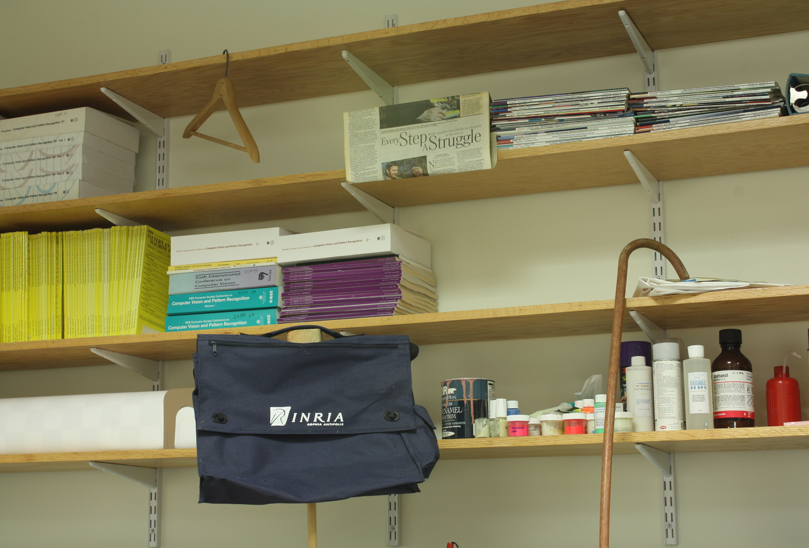
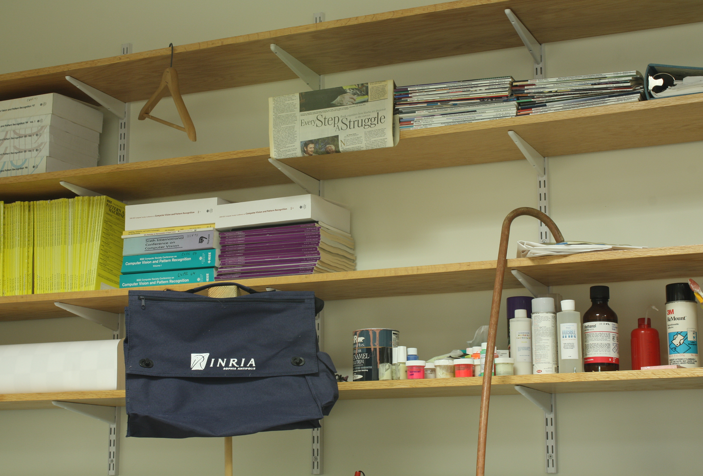
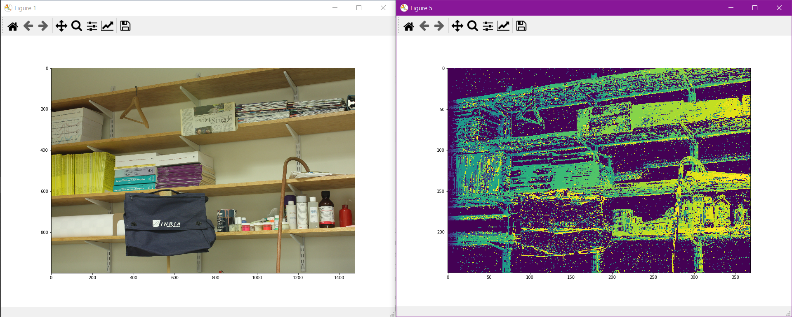

# Disparity Map
## Table of Contents
* [Introduction](#introduction)
* [Language](#language)
* [Examples of Use](#examples-of-use)
* [Project Status](#project-status)
## Introduction
Disparity Map is a small learning project for pixel-wise depth perception given a pair of photos taken from two parallel cameras. The program takes a pair of RGB images and the configuration of the cameras, and outputs a disparity map that includes the depth information on the original images.
This project aim to explore the basics of image processing(e.g. local feature extraction, correlation, variance, etc.) and computer vision(e.g. kernels). By adjusting the setting of the program, one can gain deeper intuition on these topics.
## Language
* Python 3.7
* Libraries:
   * `matplotlib` for image processing
   * `mpl_toolkits` for 3D plotting
## Examples of Use
Input image pairs:

Output disparity map:

## Project Status:
This is a learning project, and was not developed to be used for real-time depth perception in practice. At its current state, it only works on the given set of image pairs and requires tuning for different configurations.
The project was no longer being developed as the learning goal was met.
